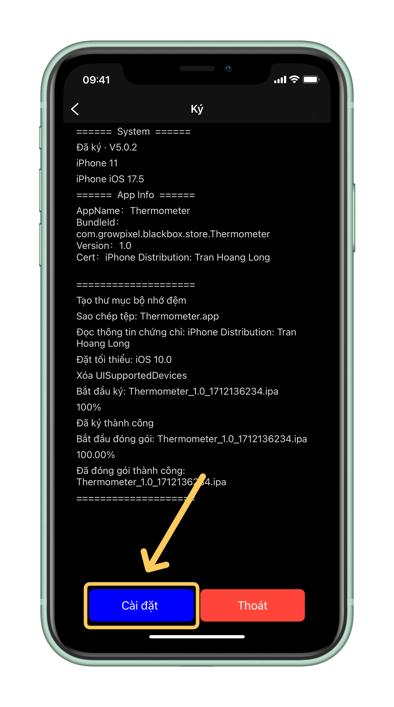

---
layout:
  title:
    visible: true
  description:
    visible: true
  tableOfContents:
    visible: true
  outline:
    visible: true
  pagination:
    visible: true
---

# 🇻🇳 Ký và cài đặt .ipa bằng ESign

<table data-full-width="false"><thead><tr><th align="center"></th></tr></thead><tbody><tr><td align="center"><em><mark style="color:yellow;"><strong>Mở app ESign và chắc chắn bạn đang ở tab Tệp (File)</strong></mark></em></td></tr></tbody></table>

<figure><figcaption></figcaption></figure>

|                                                                                 |
| :-----------------------------------------------------------------------------: |
| _<mark style="color:yellow;">**Tiếp theo, hãy bấm "•••" trên góc phải**</mark>_ |

<figure><figcaption></figcaption></figure>

|                                                              |
| :----------------------------------------------------------: |
| _<mark style="color:yellow;">**Bấm "Nhập" (Import)**</mark>_ |

<figure><figcaption></figcaption></figure>

|                                                                                                                                                                                                                                                         |
| :-----------------------------------------------------------------------------------------------------------------------------------------------------------------------------------------------------------------------------------------------------: |
| 
<em><mark style="color:yellow;"><strong>Thư mục Tệp sẽ hiện lên, bạn cần tìm file .ipa ứng dụng muốn cài [Bấm chọn file đó]</strong></mark></em> <em><mark style="color:red;"><strong>Lưu ý: file trong ảnh chỉ là ví dụ</strong></mark></em>
 |

<figure><figcaption></figcaption></figure>

<table data-full-width="false"><thead><tr><th align="center"></th></tr></thead><tbody><tr><td align="center"><em><mark style="color:yellow;"><strong>Khi bảng gợi ý nhập vào thư viện hiện lên hãy bấm "Nhập" (Import)</strong></mark></em></td></tr></tbody></table>

<figure><figcaption></figcaption></figure>

<table data-full-width="false"><thead><tr><th align="center"></th></tr></thead><tbody><tr><td align="center"><em><mark style="color:yellow;"><strong>Tiếp theo, bạn hãy chuyển sang tab Apps</strong></mark></em></td></tr></tbody></table>

<figure><figcaption></figcaption></figure>

<table data-full-width="false"><thead><tr><th align="center"></th></tr></thead><tbody><tr><td align="center"><em><mark style="color:yellow;"><strong>Bấm chọn app bạn muốn ký</strong></mark></em></td></tr></tbody></table>

<figure><figcaption></figcaption></figure>

<table data-full-width="false"><thead><tr><th align="center"></th></tr></thead><tbody><tr><td align="center"><em><mark style="color:yellow;"><strong>Chọn "Ký" (Signature)</strong></mark></em></td></tr></tbody></table>

<figure><figcaption></figcaption></figure>

<table data-full-width="false"><thead><tr><th align="center"></th></tr></thead><tbody><tr><td align="center"><em><mark style="color:yellow;"><strong>Nếu không có gì cần thay đổi hãy bấm "Chữ ký" (Signature)</strong></mark></em></td></tr></tbody></table>

<figure><figcaption></figcaption></figure>

<table data-full-width="false"><thead><tr><th align="center"></th></tr></thead><tbody><tr><td align="center"><em><mark style="color:yellow;"><strong>Đợi cho đến khi quá trình ký app hoàn thành và bấm "Cài đặt" (Install)</strong></mark></em></td></tr></tbody></table>

<figure><figcaption></figcaption></figure>

<table data-full-width="false"><thead><tr><th align="center"></th></tr></thead><tbody><tr><td align="center"><em><mark style="color:yellow;"><strong>Bảng cài đặt hiện ra và bấm "Cài đặt" (Install) một lần nữa</strong></mark></em></td></tr></tbody></table>

<figure><figcaption></figcaption></figure>
