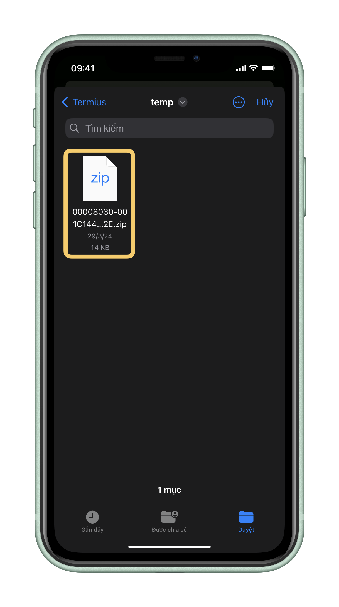
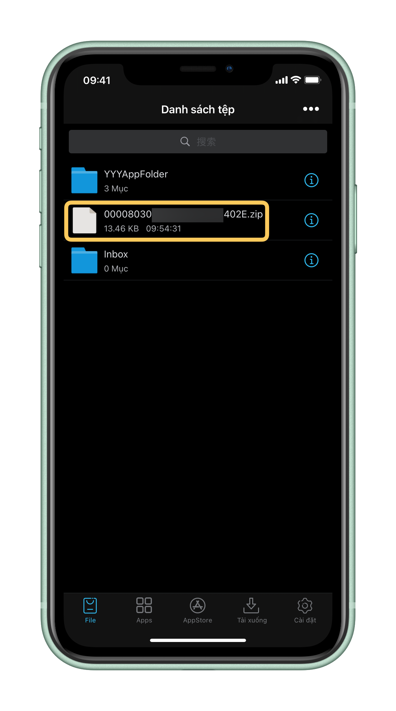
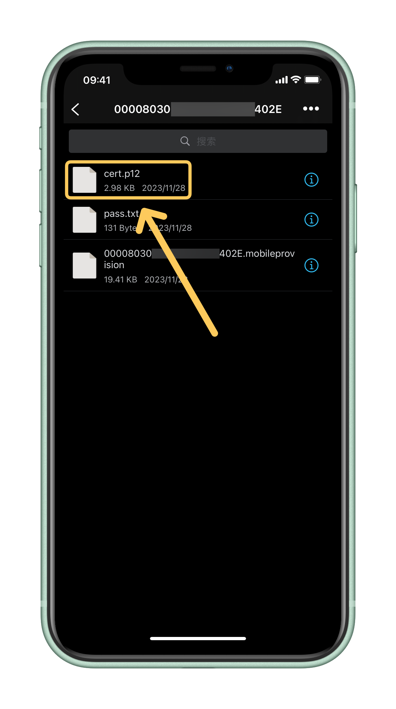
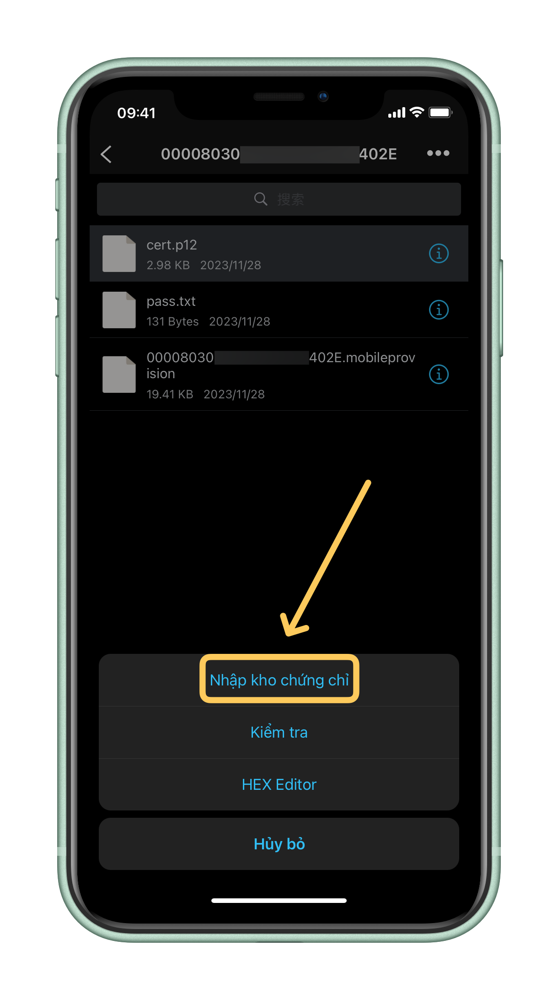
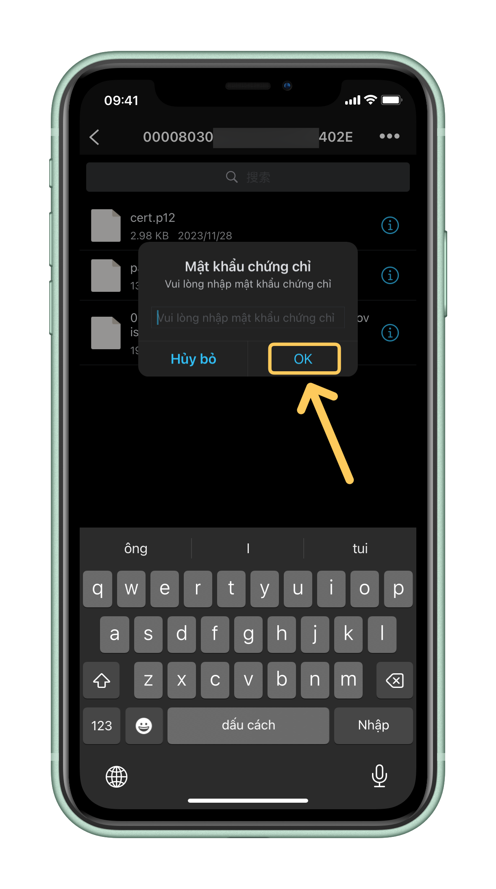
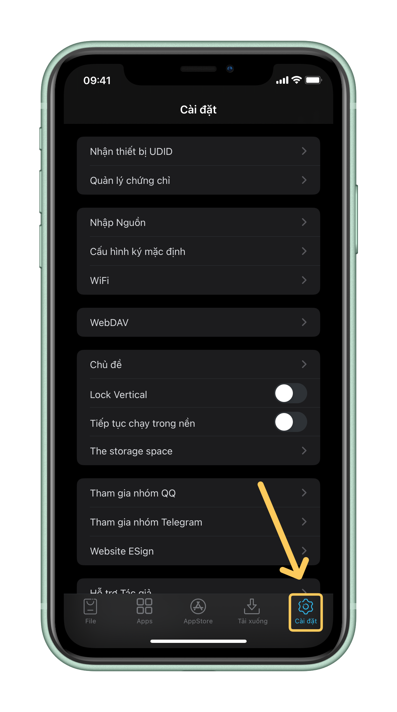

# 🇻🇳 Nhập chứng chỉ ESign

<table data-full-width="false"><thead><tr><th align="center"></th></tr></thead><tbody><tr><td align="center"><em><mark style="color:yellow;"><strong>Mở app ESign và chắc chắn bạn đang ở tab Tệp (File)</strong></mark></em></td></tr></tbody></table>

<figure><figcaption></figcaption></figure>

|                                                                                 |
| :-----------------------------------------------------------------------------: |
| _<mark style="color:yellow;">**Tiếp theo, hãy bấm "•••" trên góc phải**</mark>_ |

<figure><figcaption></figcaption></figure>

|                                                              |
| :----------------------------------------------------------: |
| _<mark style="color:yellow;">**Bấm "Nhập" (Import)**</mark>_ |

<figure><figcaption></figcaption></figure>

|                                                                                                                                                                                                                                                        |
| :----------------------------------------------------------------------------------------------------------------------------------------------------------------------------------------------------------------------------------------------------: |
| 
<em><mark style="color:yellow;"><strong>Thư mục Tệp sẽ hiện lên, bạn cần tìm file zip chứng chỉ của bạn [Bấm chọn file đó]</strong></mark></em> <em><mark style="color:red;"><strong>Lưu ý: file trong ảnh chỉ là ví dụ</strong></mark></em>
 |

<figure><figcaption></figcaption></figure>

|                                                                                  |
| :------------------------------------------------------------------------------: |
| _<mark style="color:yellow;">**Bấm vào file zip bạn vừa thêm vào ESign**</mark>_ |

<figure><figcaption></figcaption></figure>

|                                                                      |
| :------------------------------------------------------------------: |
| _<mark style="color:yellow;">**Bấm chọn "Giải nén" (Unzip)**</mark>_ |

<figure><figcaption></figcaption></figure>

|                                                                            |
| :------------------------------------------------------------------------: |
| _<mark style="color:yellow;">**Truy cập thư mục bạn vừa giải nén**</mark>_ |

<figure><figcaption></figcaption></figure>

|                                                                                                                        |
| :--------------------------------------------------------------------------------------------------------------------: |
| _<mark style="color:yellow;">**Bạn sẽ thấy file .p12 và .mobileprovision cùng thư mục, hãy bấm vào file .p12**</mark>_ |

<figure><figcaption></figcaption></figure>

|                                                                                             |
| :-----------------------------------------------------------------------------------------: |
| _<mark style="color:yellow;">**Chọn "Nhập kho chứng chỉ" (Import Certificate ...)**</mark>_ |

<figure><figcaption></figcaption></figure>

|                                                                              |
| :--------------------------------------------------------------------------: |
| _<mark style="color:yellow;">**Điền mật khẩu chứng chỉ và bấm "OK"**</mark>_ |

<figure><figcaption></figcaption></figure>

|                                                                                                                      |
| :------------------------------------------------------------------------------------------------------------------: |
| _<mark style="color:yellow;">**Để chắc chắn đã nhập chứng chỉ thành công, hãy đến tab "Cài đặt" (Settings)**</mark>_ |

<figure><figcaption></figcaption></figure>

|                                                                                           |
| :---------------------------------------------------------------------------------------: |
| _<mark style="color:yellow;">**Bấm "Quản lý chứng chỉ" (Certificate Management)**</mark>_ |

<figure><figcaption></figcaption></figure>

|                                                                                                            |
| :--------------------------------------------------------------------------------------------------------: |
| _<mark style="color:yellow;">**Nếu chứng chỉ bạn vừa thêm xuất hiện tại đây thì là đã thành công**</mark>_ |

<figure><figcaption></figcaption></figure>
